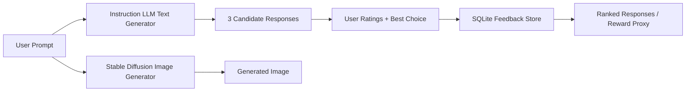

# Smart AI Assistant with Human Feedback

## Slide 1 - Title

- Smart AI Assistant with Human Feedback (Multimodal)
- Course project on LLMs, diffusion models, and RLHF concepts
- Built with FLAN-T5, Stable Diffusion, Streamlit, and SQLite

## Slide 2 - Project Objective

- Build a simplified multimodal AI system from pretrained models
- Generate text and images from the same user prompt
- Collect human feedback on text outputs
- Simulate RLHF using stored preferences and rankings

## Slide 3 - Problem Statement

- Modern AI assistants often combine multiple modalities
- Raw model outputs vary in quality
- Human feedback helps identify which responses are more useful
- The project demonstrates how feedback can improve selection without training from scratch

## Slide 4 - System Architecture

## Slide 5 - Models Used

- FLAN-T5 for text generation through Hugging Face Transformers
- Stable Diffusion v1.5 for image generation through Hugging Face Diffusers
- Pretrained models were used because the assignment does not require training from scratch
- The same prompt is shared across both models for multimodal consistency

## Slide 6 - RLHF Simulation

- Full RLHF normally includes preference collection, reward-model training, and policy optimization
- This project simulates the feedback part of RLHF
- Users rate each response from 1 to 5
- Users also select the single best response
- Rankings are updated using best votes and average ratings

## Slide 7 - Implementation Details

- Streamlit UI for easy live demo
- Python package split into:
  - `generation.py` for the text model and Stable Diffusion
  - `storage.py` for feedback persistence and ranking
  - `config.py` for model and runtime settings
- SQLite database stores responses and feedback entries
- Generated images are saved locally for reuse in the presentation/demo

## Slide 8 - Example Workflow

- Prompt: `A robot helping humans in daily life`
- System generates three different text responses
- User rates the responses and selects the best one
- Stable Diffusion creates one image from the same prompt
- The ranking table updates to show the most preferred response

## Slide 9 - Challenges and Observations

- Stable Diffusion requires significant compute, especially without a GPU
- Instruction-tuned text models produce cleaner outputs for this task than base autocomplete-style models
- Human ratings can be subjective, but they still provide a useful reward signal
- The same prompt must be visual and descriptive to work across text and image generation

## Slide 10 - Conclusion

- The project successfully combines text generation, human feedback, and image generation
- It demonstrates the main idea behind RLHF in a simplified way
- The system is modular and can be extended with larger models or automated evaluation
- Future work could include true preference modeling or fine-tuning based on collected feedback

## Slide 11 - Demo Plan

- Enter one multimodal prompt
- Show three generated text responses
- Rate each response and select the best one
- Show the updated ranking table
- Show the generated image

## Slide 12 - Questions

- Why is this only a simulation of RLHF?
- How could the reward model be improved?
- What would change if a stronger LLM were used?
- How could image feedback be added in a future version?
